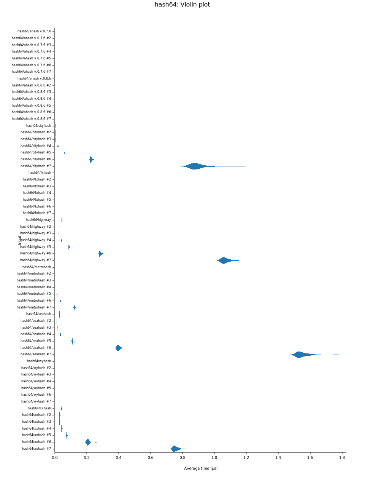
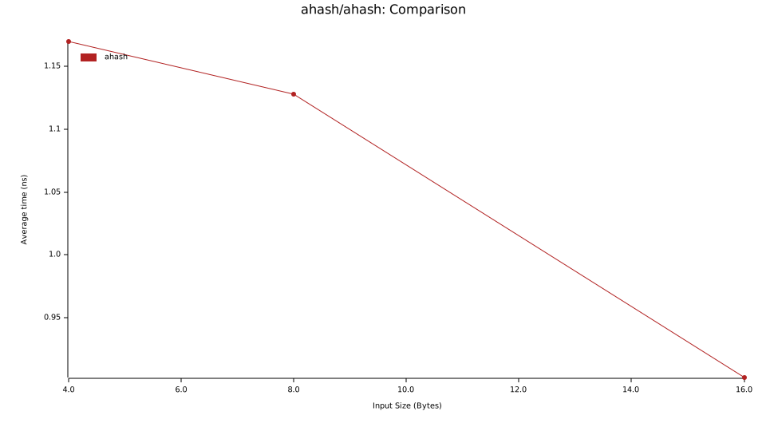

# hash-comparison

Cmd:

```sh
 RUSTFLAGS="-C target-feature=+aes,+ssse3,+sse4.2" cargo bench --target=x86_64-unknown-linux-musl
```

| Alg       |     License     |                       Problems |
| :-------- | :-------------: | -----------------------------: |
| xxhash    |     BSL-1.0     | DiffDist bit 7 w. 36 bits, BIC |
| Ahash     | MIT, Apache-2.0 |                           None |
| Wyhash    | MIT, Apache-2.0 |                           None |
| Seahash   |       MIT       |             PerlinNoise, !msvc |
| Metrohash |       MIT       |              UB, LongNeighbors |
| Highway   |       MIT       |                           None |
| Fxhash    |       ???       |                            ??? |
| CityHash  | MIT, Apache-2.0 |               Sparse, TwoBytes |

## All Algs


<!--  -->



<!--  -->

## All Algs (4B, 8B, 16B)

/report/lines.svg")

/report/violin.svg")

## AHash, Fxhash, Metrohash, Wyhash (4B, 8B, 16B)

 v2.0/report/lines.svg")

 v2.0/report/violin.svg")

## AHash (+ssse3, +aes) (4B, 8B, 16B)

/report/lines.svg")

/report/violin.svg")

## AHash (4B, 8B, 16B)




