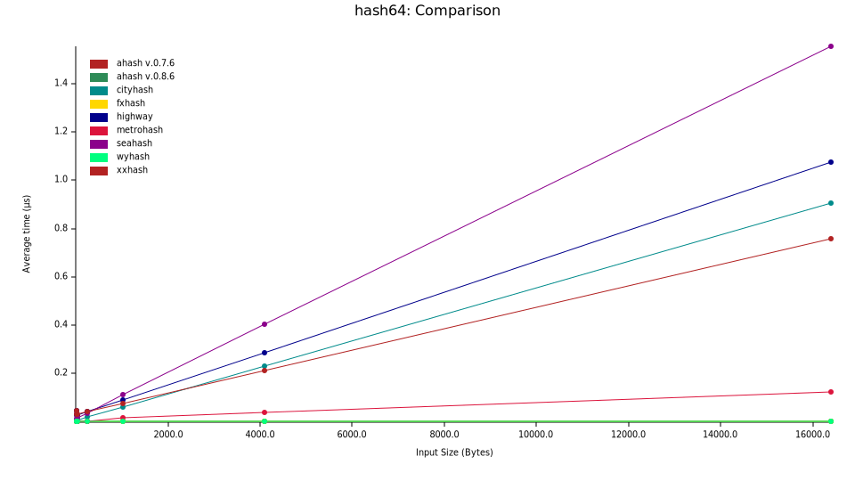

# hash-comparison

Cmd:

```sh
 RUSTFLAGS="-C target-feature=+aes,+ssse3,+sse4.2" cargo bench --target=x86_64-unknown-linux-musl
```

| Alg       |     License     |                       Problems |
| :-------- | :-------------: | -----------------------------: |
| xxhash    |     BSL-1.0     | DiffDist bit 7 w. 36 bits, BIC |
| Ahash     | MIT, Apache-2.0 |                           None |
| Wyhash    | MIT, Apache-2.0 |                           None |
| Seahash   |       MIT       |             PerlinNoise, !msvc |
| Metrohash |       MIT       |              UB, LongNeighbors |
| Highway   |       MIT       |                           None |
| Fxhash    |       ???       |                            ??? |
| CityHash  | MIT, Apache-2.0 |               Sparse, TwoBytes |

## All Algs



<!--  -->


<!--  -->

## All Algs (4B, 8B, 16B)

<!-- /report/lines.svg") -->

<!-- /report/violin.svg") -->


## AHash, Fxhash, Metrohash, Wyhash (4B, 8B, 16B)

<!--  v2.0/report/lines.svg") -->

<!--  v2.0/report/violin.svg") -->


## AHash (+ssse3, +aes) vs Ahash

```sh
running 0 tests

test result: ok. 0 passed; 0 failed; 0 ignored; 0 measured; 0 filtered out; finished in 0.00s

ahash/ahash             time:   [1.1232 ns 1.1254 ns 1.1279 ns]
                        thrpt:  [3.3029 GiB/s 3.3101 GiB/s 3.3168 GiB/s]
                 change:
                        time:   [-16.722% -15.961% -14.895%] (p = 0.00 < 0.05)
                        thrpt:  [+17.502% +18.992% +20.080%]
                        Performance has improved.
Found 7 outliers among 100 measurements (7.00%)
  3 (3.00%) high mild
  4 (4.00%) high severe
ahash/ahash #2          time:   [1.1270 ns 1.1322 ns 1.1381 ns]
                        thrpt:  [6.5463 GiB/s 6.5805 GiB/s 6.6111 GiB/s]
                 change:
                        time:   [-17.726% -16.579% -15.423%] (p = 0.00 < 0.05)
                        thrpt:  [+18.235% +19.874% +21.545%]
                        Performance has improved.
Found 11 outliers among 100 measurements (11.00%)
  4 (4.00%) high mild
  7 (7.00%) high severe
ahash/ahash #3          time:   [897.88 ps 899.40 ps 901.08 ps]
                        thrpt:  [16.537 GiB/s 16.568 GiB/s 16.596 GiB/s]
                 change:
                        time:   [-30.688% -30.334% -29.962%] (p = 0.00 < 0.05)
                        thrpt:  [+42.779% +43.543% +44.275%]
                        Performance has improved.
Found 14 outliers among 100 measurements (14.00%)
  10 (10.00%) high mild
  4 (4.00%) high severe
ahash/ahash #4          time:   [5.9639 ns 6.0493 ns 6.1473 ns]
                        thrpt:  [38.784 GiB/s 39.412 GiB/s 39.977 GiB/s]
                 change:
                        time:   [-55.935% -55.490% -55.067%] (p = 0.00 < 0.05)
                        thrpt:  [+122.55% +124.67% +126.94%]
                        Performance has improved.
Found 6 outliers among 100 measurements (6.00%)
  2 (2.00%) high mild
  4 (4.00%) high severe
ahash/ahash #5          time:   [19.714 ns 19.766 ns 19.831 ns]
                        thrpt:  [48.090 GiB/s 48.248 GiB/s 48.376 GiB/s]
                 change:
                        time:   [-67.866% -67.387% -66.844%] (p = 0.00 < 0.05)
                        thrpt:  [+201.60% +206.62% +211.20%]
                        Performance has improved.
Found 14 outliers among 100 measurements (14.00%)
  1 (1.00%) high mild
  13 (13.00%) high severe
ahash/ahash #6          time:   [77.689 ns 77.859 ns 78.079 ns]
                        thrpt:  [48.857 GiB/s 48.995 GiB/s 49.102 GiB/s]
                 change:
                        time:   [-68.936% -68.662% -68.306%] (p = 0.00 < 0.05)
                        thrpt:  [+215.52% +219.10% +221.91%]
                        Performance has improved.
Found 8 outliers among 100 measurements (8.00%)
  4 (4.00%) high mild
  4 (4.00%) high severe
ahash/ahash #7          time:   [304.12 ns 304.60 ns 305.15 ns]
                        thrpt:  [50.004 GiB/s 50.094 GiB/s 50.173 GiB/s]
                 change:
                        time:   [-69.777% -69.630% -69.466%] (p = 0.00 < 0.05)
                        thrpt:  [+227.51% +229.27% +230.87%]
                        Performance has improved.
Found 13 outliers among 100 measurements (13.00%)
  2 (2.00%) high mild
  11 (11.00%) high severe
```
